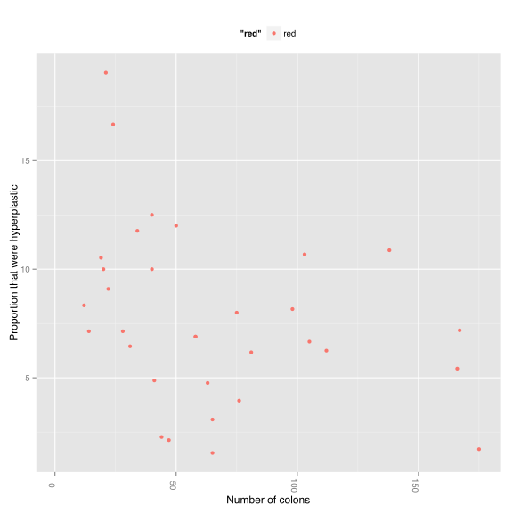

---
author: Sebastian Zeki
date: November 12th, 2016
     St Thomas' Adenoma Detection Rates for GRS
---

|Endo_Endoscopist           | WithdrawalTime.y| NumHyperplastics| NumColons.x| PropHyperplastic| NumAdenomas| NumColons.y| PropAdenomas| HyperplasticToAdenomaRatio|
|:--------------------------|----------------:|----------------:|-----------:|----------------:|-----------:|-----------:|------------:|--------------------------:|
| Alexis Schizas            |              NaN|                2|          41|             4.88|          41|          41|          100|                      20.50|
| Amir Darakhshan           |              NaN|                2|          22|             9.09|          22|          22|          100|                      11.00|
| Amrutha Ramu              |              NaN|                6|          50|            12.00|          50|          50|          100|                       8.33|
| Andy Williams             |              NaN|                2|          28|             7.14|          28|          28|          100|                      14.00|
| Annika Charlesworth       |              NaN|                4|          58|             6.90|          58|          58|          100|                      14.50|
| Answar Abdulrehman        |              NaN|               NA|          10|               NA|          10|          10|          100|                         NA|
| Ben Warner                |              NaN|                7|         112|             6.25|         112|         112|          100|                      16.00|
| Caris Grimes              |              NaN|               NA|          11|               NA|          11|          11|          100|                         NA|
| Christopher Chia          |              NaN|                1|          44|             2.27|          44|          44|          100|                      44.00|
| Emma Johnston             |              NaN|                7|         105|             6.67|         105|         105|          100|                      15.00|
| Giovanni Tritto           |              NaN|                4|          24|            16.67|          24|          24|          100|                       6.00|
| Ikram Nasr                |              NaN|                6|          75|             8.00|          75|          75|          100|                      12.50|
| Ioannis Koumoutsos        |              NaN|               12|         167|             7.19|         167|         167|          100|                      13.92|
| Jason Dunn                |              NaN|                2|          20|            10.00|          20|          20|          100|                      10.00|
| Jeremy Sanderson          |              NaN|                5|          40|            12.50|          40|          40|          100|                       8.00|
| John Meenan               |              NaN|               NA|          44|               NA|          44|          44|          100|                         NA|
| Jonathan Digby Bell       |              NaN|               NA|           1|               NA|           1|           1|          100|                         NA|
| Jonathan DigbyBell        |              NaN|                9|         166|             5.42|         166|         166|          100|                      18.44|
| Jorge Morais              |              NaN|                3|         175|             1.71|         175|         175|          100|                      58.33|
| Kamal Patel               |              NaN|                5|          81|             6.17|          81|          81|          100|                      16.20|
| Mark George               |              NaN|                1|          47|             2.13|          47|          47|          100|                      47.00|
| Mark Samaan               |              NaN|               15|         138|            10.87|         138|         138|          100|                       9.20|
| Michele McCarthy          |              NaN|                2|          31|             6.45|          31|          31|          100|                      15.50|
| Omar Mansour              |              NaN|               NA|           5|               NA|           5|           5|          100|                         NA|
| Patrick Wilson            |              NaN|                3|          63|             4.76|          63|          63|          100|                      21.00|
| Peter Irving              |              NaN|                1|          65|             1.54|          65|          65|          100|                      65.00|
| Rimma Goldberg            |              NaN|                4|          40|            10.00|          40|          40|          100|                      10.00|
| Robin Dart                |              NaN|               NA|          26|               NA|          26|          26|          100|                         NA|
| Sabina DeMartino          |              NaN|               11|         103|            10.68|         103|         103|          100|                       9.36|
| Sarah EL-Salamani         |              NaN|               NA|           7|               NA|           7|           7|          100|                         NA|
| Simon Anderson            |              NaN|                4|          34|            11.76|          34|          34|          100|                       8.50|
| Sreelakshmi Kotha         |              NaN|                2|          19|            10.53|          19|          19|          100|                       9.50|
| Steven Fong               |              NaN|                2|          65|             3.08|          65|          65|          100|                      32.50|
| Terry Wong                |              NaN|                1|          12|             8.33|          12|          12|          100|                      12.00|
| Triantafyllios Doulias    |              NaN|               NA|           1|               NA|           1|           1|          100|                         NA|
| Vi Nguyen                 |              NaN|               NA|           4|               NA|           4|           4|          100|                         NA|
| Vivek Datta               |              NaN|                4|          58|             6.90|          58|          58|          100|                      14.50|
| Vivienne Sayer            |              NaN|                8|          98|             8.16|          98|          98|          100|                      12.25|
| Yasser Elsherif           |              NaN|               NA|          15|               NA|          15|          15|          100|                         NA|
|M.D. Efthymios Ypsilantis  |              NaN|                1|          14|             7.14|          14|          14|          100|                      14.00|
|Ms Harriet Watson          |              NaN|                3|          76|             3.95|          76|          76|          100|                      25.33|
|NA                         |              NaN|                4|          21|            19.05|          21|          21|          100|                       5.25|

Table 1: Adenoma detection rates 

<figure><figcaption>Figure 1: Number of hyperplastic polyps detected according to number of colonoscopies performed</figcaption></figure>

